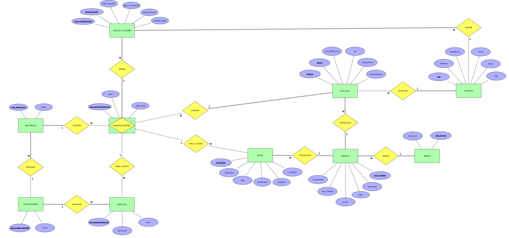

# Projeto final BAN II UDESC

Projeto final para  a disciplina de banco de dados II da Universidade Estadual de Santa Catarina (UDESC)

Este projeto está em produção no heroku. Você pode testar o aplicativo de forma online [aqui](https://nasa-challenge-flask-example.herokuapp.com/).

## Escopo
O projeto visa implementar um sistema de controle para personalização de veículos, contendo o registro persistente de clientes, 
mecânicos, veículos e serviços de personalização realizados, além de também conter o registro de contas a receber 
referentes às personalizações realizadas.

## Requisitos

### Implementação do diagrama de entidade-relacionamento (ER)
Criação das tabelas e campos na base de dados de acordo com as especificações do seguinte modelo:

A ddl de criação das tabelas está disponível no arquivo [ddl.sql](database/ddl.sql)

### Regras de negócio para contas a receber

Implementação dos seguintes controles em contas a receber:

#### Impedir a inserção de contas a receber duplicados

Pode existir um id de contas a receber por personalização de veículo realizada. Em caso de 
pagamento parcelado, deve ser inserido um novo registro para o id já existente e informar o numerp da parcela no 
campo `num_parcela` (por este motivo que este campo faz parte da chave primária da tabela de contas a receber).

#### Atualizar o total de parcelas

Na necessidade de inserção de novo contas a receber de uma personalização de veículo, é necessário atualizar o campo
`total_parcelas` nos registros de contas a receber já existentes para que fique de acordo 
após a inserção das novas parcelas.

#### Tratamento de inadimplentes

Não permitir a inserção de novas personalizações para clientes inadimplentes.

Cliente inadimplente é o cliente que possui parcelas na tabela de contas a receber nas seguintes condições:
- Parcelas não pagas (campo `parcela_paga` igual a False)
- Parcelas já vencidas (campo `data_vencimento` < data atual)
- Somatório do campo `valor_parcela` das parcelas que atendam os dois critérios acima seja acima de 5000

### Regras para inserção de veículo

A placa do veículo deve ser válida nos seguintes formatos:
- Padrão antigo: 3 letras e 4 números (Ex. AAA1234)
- Padrão novo: 3 letras, 1 número, 1 letra e 2 números (Ex. AAA1A23)

### Implementação das regras

A implementação foi realizada através da criação de gatilhos na base de dados que são ativados após a inserção (ou
atualização quando conveniente) nas tabelas envolvendo as regras especificadas.

A fonte dos gatilhos estão disponíveis no arquivo [triggers.sql](database/triggers.sql)  

## ESPECIFICAÇÕES TÉCNICAS

### Stack utilizada

**Python**
- Lóginas de interface para persistência de dados

**Python Flask**
- Conteúdo dinâmico nas páginas html da aplicação
- Configuração de rotas das páginas da aplicação e das APIs

**Html, Css, Javascript**
- Front-end da aplicação

**Postgres**
- Persistência dos dados 